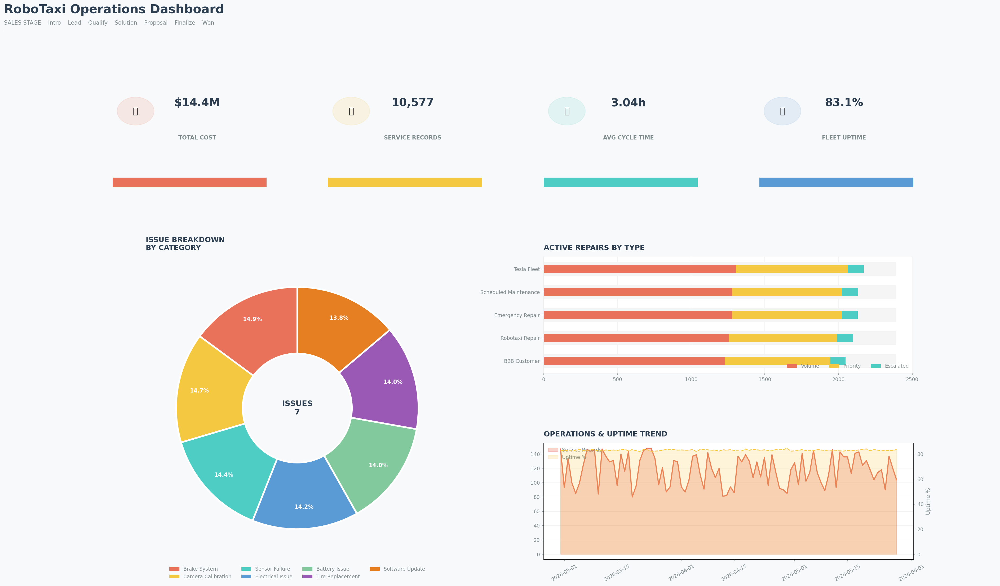

# RoboTaxi Operations Analytics Dashboard

An end-to-end operations analytics project analyzing Tesla RoboTaxi 
service operations including technician scheduling, service cycle times, 
fleet uptime, and MTBF tracking across 200 vehicles and 5 regions.

## Operations Summary
- **Total Vehicles:** 200
- **Total Service Records:** 10,577
- **Days of Data:** 90
- **Total Operations Cost:** $14.4M
- **Avg Service Cycle Time:** 3.04 hours
- **Avg Fleet Uptime:** 83.07%
- **Avg MTBF:** 308 hours
- **Avg Resolution Rate:** 92%

## Dashboard Visualizations

1. Issue Category Breakdown (Donut Chart)
2. Active Repairs by Type
3. Operations & Uptime Trend (90 Days)
4. KPI Cards — Cost, Records, Cycle Time, Uptime

## Regions Covered
- Phoenix, AZ
- Austin, TX
- Las Vegas, NV
- San Francisco, CA
- Miami, FL

## Vehicle Models
- Model 3
- Model Y
- Cybercab

## Technologies
- Python, Pandas, NumPy
- Matplotlib, Seaborn
- Google Colab (T4 GPU)
